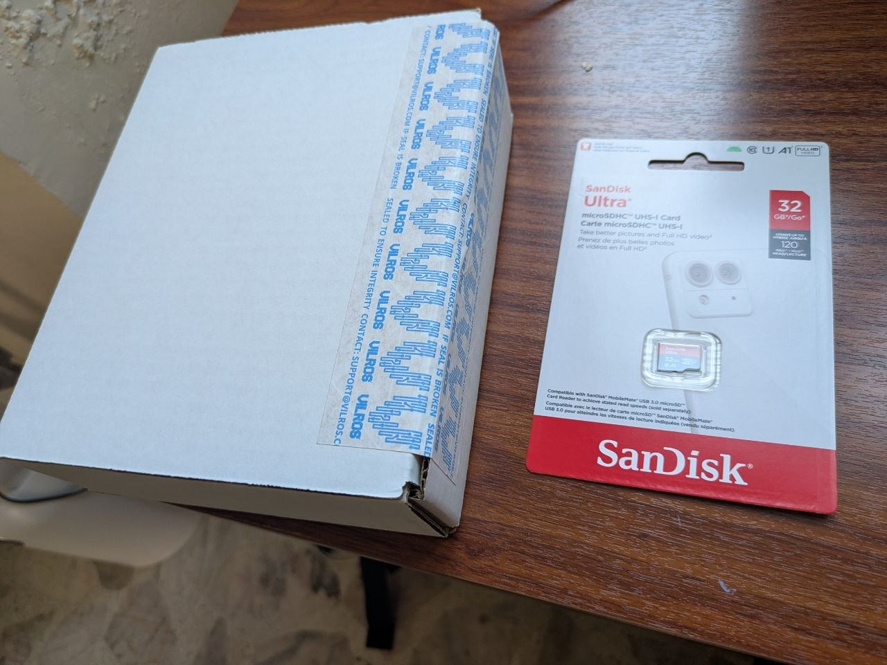
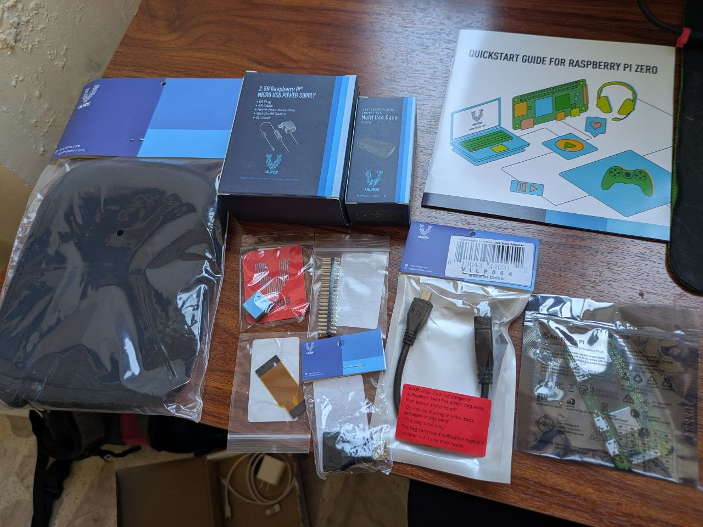

Setting up a Raspberry Pi Zero 2W from scratch, ready to run Ambrosia.



## What You'll Need

**[Vilros Raspberry Pi Zero 2W Starter Kit](https://www.amazon.com.mx/Vilros-Raspberry-Zero-multiprop%C3%B3sito-HDMI-adaptadores/dp/B09M1PS35R)** — includes:
- Raspberry Pi Zero 2W board
- Multi-purpose ABS case
- Micro-USB power supply
- Mini-HDMI to HDMI adapter
- Micro-USB to USB-A adapter

**Sold separately:**
- microSD card — 32GB or larger (a SanDisk Ultra 32GB works well; not included in the Vilros bundle)
- A computer with a microSD card reader (to flash the OS)



**Software (on your computer):**
- [Raspberry Pi Imager](https://www.raspberrypi.com/software/) (free, works on Windows/Mac/Linux)

**Network:**
- Wi-Fi network (the Pi Zero 2W has built-in Wi-Fi)

---

## Step 1: Flash Raspberry Pi OS onto the SD Card

We'll use **Raspberry Pi Imager** to write the operating system to the microSD card. This tool handles downloading the OS image and writing it for you.

### 1.1 Install Raspberry Pi Imager

Download and install from [raspberrypi.com/software](https://www.raspberrypi.com/software/).

On Debian/Ubuntu, you can also install the `.deb` directly:

```bash
wget https://github.com/raspberrypi/rpi-imager/releases/download/v2.0.8/rpi-imager_2.0.8_amd64.deb
sudo apt install ./rpi-imager_2.0.8_amd64.deb
```

### 1.2 Open the SD card packaging and insert it into your computer

Insert the 32GB microSD card into your computer's card reader (you may need a microSD-to-SD adapter or a USB card reader).

### 1.3 Open Raspberry Pi Imager and configure it

```bash
rpi-imager
```

1. Click **CHOOSE DEVICE** and select **Raspberry Pi Zero 2 W**
2. Click **CHOOSE OS** and select **Raspberry Pi OS (other)** → **Raspberry Pi OS Lite (64-bit)**
   - We use **Raspberry Pi OS Lite** because it has the smallest memory footprint — important on the Zero 2W's 512MB RAM
   - **Lite** = no desktop (we'll run everything headless, no monitor needed)
   - **64-bit** is required because Ambrosia's dependencies need ARM64
   - Ubuntu Server also works (it's Debian-based too), but uses more RAM at idle
3. Click **CHOOSE STORAGE** and select your 32GB microSD card

### 1.4 Configure settings (important!)

Before writing, click the **gear icon** (⚙) or **NEXT** and then **EDIT SETTINGS** to customize:

**General tab:**
- **Set hostname:** `ambrosia-<name>` — replace `<name>` with your name (e.g. `ambrosia-chris`). Everyone on the same network needs a unique hostname!
- **Set username and password:** Pick a username and a strong password — you'll use these to log in via SSH
- **Configure wireless LAN:** Enter your Wi-Fi network name (SSID) and password
- **Set locale settings:** Choose your time zone and keyboard layout

**Services tab:**
- **Enable SSH:** Check this box and select **Use password authentication**

These settings are critical — without them you won't be able to connect to the Pi remotely.

### 1.5 Write the image

1. Click **SAVE**, then **YES** to apply the custom settings
2. Click **YES** to confirm writing (this will erase everything on the SD card)
3. Wait for the write and verification to complete

---

## Step 2: Boot the Raspberry Pi

1. Remove the microSD card from your computer
2. Insert it into the Raspberry Pi Zero 2W (the slot is on the bottom of the board)
3. Connect the micro-USB power supply

The Pi will boot up and automatically connect to your Wi-Fi network. Give it a minute or two for the first boot — it needs to resize the filesystem and apply your settings.

---

## Step 3: Connect to the Pi via SSH

From your computer, open a terminal and connect:

```bash
ssh <your-username>@ambrosia-<name>.local
```

(Replace `<your-username>` with the username you set in Step 1.4, and `<name>` with the name you chose for your hostname)

If `ambrosia-<name>.local` doesn't resolve, you may need to find the Pi's IP address from your router's admin page, and connect with:

```bash
ssh <your-username>@<ip-address>
```

Accept the host key fingerprint when prompted, then enter your password.

You should now be logged into your Raspberry Pi.

---

## Step 4: Wait for automatic updates to finish

On first boot, Raspberry Pi OS runs `unattended-upgrades` in the background. This holds the apt lock and can take 10-20 minutes on the Pi Zero 2W. You **must** wait for it to finish before installing anything.

You can check if it's still running:

```bash
sudo tail -f /var/log/unattended-upgrades/unattended-upgrades.log
```

Wait until you see it finish, then Ctrl+C.

## Step 5: Update the system and add swap

### 5.1 Add swap space

The Pi Zero 2W only has 512MB of RAM, which isn't enough to comfortably run Ambrosia. Add 1GB of swap:

```bash
sudo fallocate -l 1G /swapfile
sudo chmod 600 /swapfile
sudo mkswap /swapfile
sudo swapon /swapfile
echo '/swapfile none swap sw 0 0' | sudo tee -a /etc/fstab
```

Verify with `free -h` — you should see 1.0Gi of swap.

### 5.2 Update packages

```bash
sudo apt update && sudo apt upgrade -y
```

### 5.3 Disable unattended-upgrades (optional)

To save RAM on this constrained device:

```bash
sudo apt remove -y unattended-upgrades
```

---

## Next Steps

Your Pi is ready. Head over to [Install Ambrosia on Raspberry Pi](./rpi-install.md) to set up the POS system.
